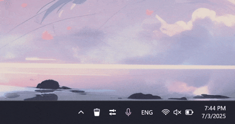

<h1  align="center">SimpleBin</h1>

### Description

This is a small program that adds a system recycle bin shortcut to the tray.

### Functions

- Recycle Bin tray icon
- Auto-switching icon theme (light/dark)
- You can add or remove this program at startup
- This application tracks all changes in the Recycle Bin in real time, updating its status immediately when files are added or removed.

### System requirement

- minimal os: windows 10.0.19041.0
- NET Runtime 9 (the installer will download it automatically if not already installed on your PC)

### Performance

In my tests, the tool consumes 10–11 MB of RAM; your system’s resource usage may differ.

### How to use

- Left-click (single): Opens the system Recycle Bin.
- Right-click (single): Opens a menu with the following options:
  - View size and file count in the Recycle Bin.
  - Empty Recycle Bin (delete all files permanently).
  - Open Settings (configure the utility).
  - Exit (close the program).
